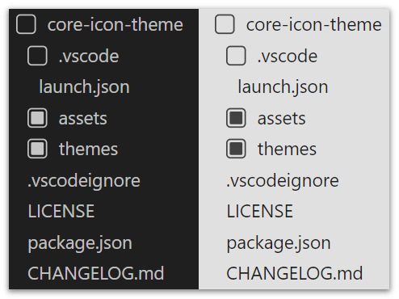

# Core Icon Theme

An extension providing several file icon theme options to [Visual Studio Code],
emphasising freedom from icon variation clutter.

[Visual Studio Code]: https://code.visualstudio.com/

## Features

- Only folder items in the explorer view are assigned icons.
- All icons have variants that cater to light mode themes.
- All icon theme variations force the [`hidesExplorerArrows`] setting.
    - These default built-in elements are considered superfluous because the
      icons themselves can represent folder expansion state.
- Icons are intentionally left-aligned so that folder entries share a common
  horizontal alignment edge with iconless file items.

[`hidesExplorerArrows`]: https://code.visualstudio.com/api/extension-guides/file-icon-theme#folder-icons-in-file-icon-themes

## Notes

- Consideration: do some extension plumbing to only expose a single icon theme
  and allow for the icon set variation to be configured via a separate setting.
- Consideration: provide a setting that opts into using an empty icon
  placeholder for file items. This would horizontally align the text of the
  latter with folder items, which might appear clearer for some.
