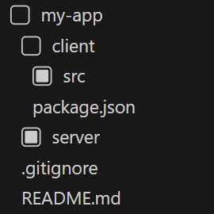

# Core Icon Theme

A [Visual Studio Code] extension that provides a configurable file icon theme
with no icon variation clutter.

[Visual Studio Code]: https://code.visualstudio.com/

## Features

- Only folder items in the explorer view are assigned visible icons.
- Forces the [`hidesExplorerArrows`] icon theme setting because the icons for
  folder items already indicate folder expansion state, which makes the arrows
  themselves superfluous.

[`hidesExplorerArrows`]: https://code.visualstudio.com/api/extension-guides/file-icon-theme#folder-icons-in-file-icon-themes

> [!NOTE]
> The web version of this extension ships with default settings that cannot be further configured.

The following is a listing of all configurable settings for this extension.

| Setting                          | Description                                                                                                                                         |
| -------------------------------- | --------------------------------------------------------------------------------------------------------------------------------------------------- |
| `core-icon-theme.emptyFileIcon`  | Use an empty placeholder icon for file items. This affects the alignment of text appearing alongside file items in areas such as the explorer view. |
| `core-icon-theme.iconColor`      | Change the colour of icons.                                                                                                                         |
| `core-icon-theme.iconType`       | Change the icon design.                                                                                                                             |
